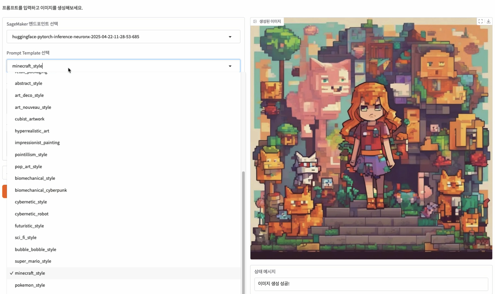
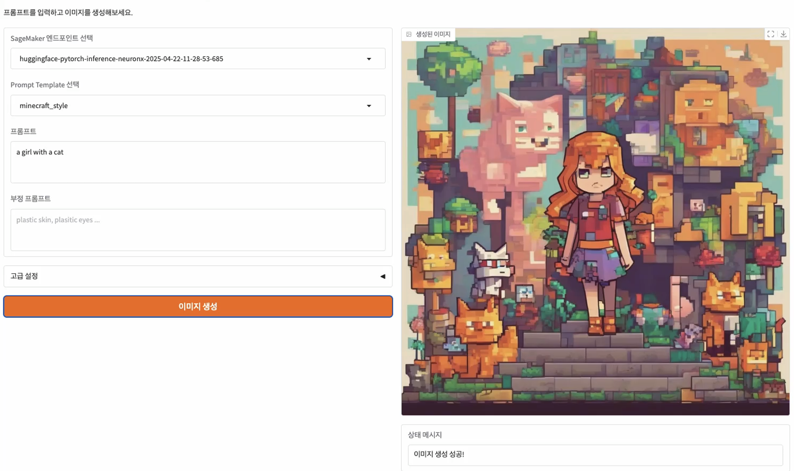
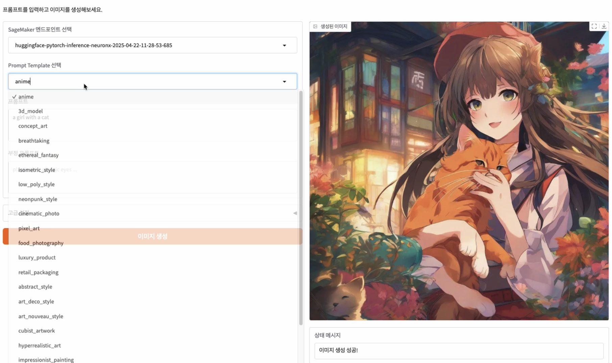
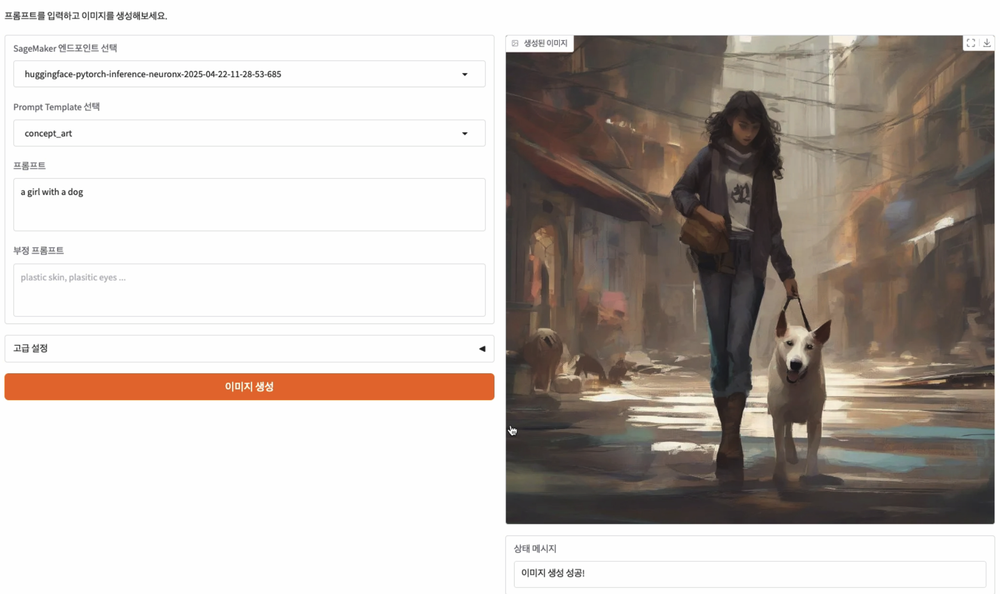

# SDXL on AWS Inferentia2

This project demonstrates how to run the **Stable Diffusion XL (SDXL)** model efficiently on **Amazon SageMaker** powered by **AWS Inferentia2**. It includes experiments from running SDXL on CUDA to compiling and deploying it for real-time inference using AWS Neuron SDK and SageMaker endpoints.

> 📚 README in [Korean](./README.ko.md)

## 📂 Project Structure

```
sdxl_inf2/
├── SDXL_test_on_cuda.ipynb         # Run SDXL model on CUDA
├── Stable_Diffusion_on_INF2.ipynb  # Compile model for Inferentia2 and upload to S3
├── invoke_sdxl_inf2.ipynb          # Call SageMaker endpoint for image generation
├── requirements.txt                # Required Python packages
├── templates.py                    # Prompt helper utilities
├── output_image.jpg                # Sample generated image
├── sample_image_M_40_01.png        # Prompt sample image
└── README.md
```

## 🧪 1. Running SDXL on CUDA

The `SDXL_test_on_cuda.ipynb` notebook loads and tests the SDXL model on a local CUDA-enabled GPU.

Install dependencies:
```bash
pip install diffusers transformers accelerate
```

Example usage:
```python
from diffusers import StableDiffusionXLPipeline

pipe = StableDiffusionXLPipeline.from_pretrained("stabilityai/stable-diffusion-xl-base-1.0")
pipe.to("cuda")

image = pipe("a fantasy castle at sunset").images[0]
image.save("output_image.jpg")
```

## ⚙️ 2. Compile Model for Inferentia2 and Upload

The `Stable_Diffusion_on_INF2.ipynb` notebook uses Optimum Neuron to compile the model and upload the result to Amazon S3.

Install dependencies:
```bash
pip install "optimum-neuron[diffusers]" sagemaker
```

## 🚀 3. Deploy to SageMaker and Run Inference

Deploy the compiled model using an `ml.inf2.xlarge` SageMaker instance and run real-time inference with `invoke_sdxl_inf2.ipynb`.

Sample inference call:
```python
import boto3, json, base64
from PIL import Image
from io import BytesIO

client = boto3.client("sagemaker-runtime")
response = client.invoke_endpoint(
    EndpointName="your-endpoint-name",
    ContentType="application/json",
    Body=json.dumps({"prompt": "a futuristic city at dawn"})
)

result = json.loads(response["Body"].read())
img_data = base64.b64decode(result["image_base64"])
Image.open(BytesIO(img_data)).show()
```

## Gradio
You can test Stable Diffusion via a deployed SageMaker Endpoint using Gradio.
As shown in the image below, several predefined Prompt Profiles have been created within Gradio.
By simply entering a few descriptive keywords about the object you want to generate, SDXL will produce an image based on the corresponding predefined template.



- examples:




## 🔐 Security Best Practices

This project follows AWS security best practices:

- **IAM least privilege**: IAM roles for SageMaker and S3 use only necessary permissions.
- **S3 encryption**: Artifacts are stored encrypted using SSE-KMS.
- **Private endpoints**: SageMaker endpoints are deployed within a VPC.
- **CloudWatch logging**: Inference requests and errors are logged with CloudWatch.

## 📚 References

- [Stable Diffusion XL on Hugging Face](https://huggingface.co/stabilityai/stable-diffusion-xl-base-1.0)
- [Optimum Neuron Documentation](https://huggingface.co/docs/optimum-neuron/)
- [Amazon SageMaker with Neuron Instances](https://docs.aws.amazon.com/sagemaker/latest/dg/inference-neuron.html)
